# Tussentijdsexamen Programming advanced

Jij bent verantwoordelijk voor het programmeren van een docent-overzichtsysteem. Lagere school "De scheve schommel" wenst een overzicht te krijgen van alle docenten en studenten. Het moet mogelijk zijn om docenten en studenten toe te voegen, te editeren alsook het toekennen van een student aan een docent. Wanneer de applicatie start, zien we testdata a.d.h.v. de statische objecten die staan gedefinieerd onder de **/Data/Repositories** folder. Het is niet de bedoeling dat gegevens worden opgeslagen na het sluiten van de applicatie.

Voordat je start met het programmeren van deze applicatie, raad ik je aan om dit document grondig te lezen. Verder kan je best ook al eens testen of je de applicatie kan opstarten. Indien de applicatie niet start, gelieve je docent zo spoedig mogelijk te contacteren.

## Ready... Set... Eerst nog wat extra info!

Alle nodige bestanden zijn reeds (uiteraard) leeg aangemaakt. Het is niet nodig om extra bestanden (zoals klasse, interfaces, ...) toe te voegen aan dit project. Je bent zelf verantwoordelijk om te bepalen waar je welke code moet toevoegen om tot een werkend resultaat te komen. Het is wel de bedoeling dat alle bestanden in folders **/Data/IRepositories**, **/Data/Repositories**, **/Models**, **/ViewModel** en **/Views** gebruikt worden! De MVVM toolkit is al geïnstalleerd in dit project en de Globalusing.cs bevat alle nodige namespaces. Tip: Open **/Data/Repositories/DocentRepository.cs** en **/Data/Repositories/StudentRepository.cs** en bekijk deze bestanden alvorens je start met programmeren.

## Go!

Onze applicatie toont het hoofdscherm wanneer deze opstart. We krijgen dan onze testinformatie te zien. Zoals te zien op figuur 1, hebben docenten enkel een id, voornaam en achternaam. Verder hebben studenten een id, voornaam en achternaam, alsook een docent. Let op: een Student-object zal geen Docent-object bijhouden, maar enkel een DocentId. Zie **/Data/Repositories/StudentRepository.cs**.

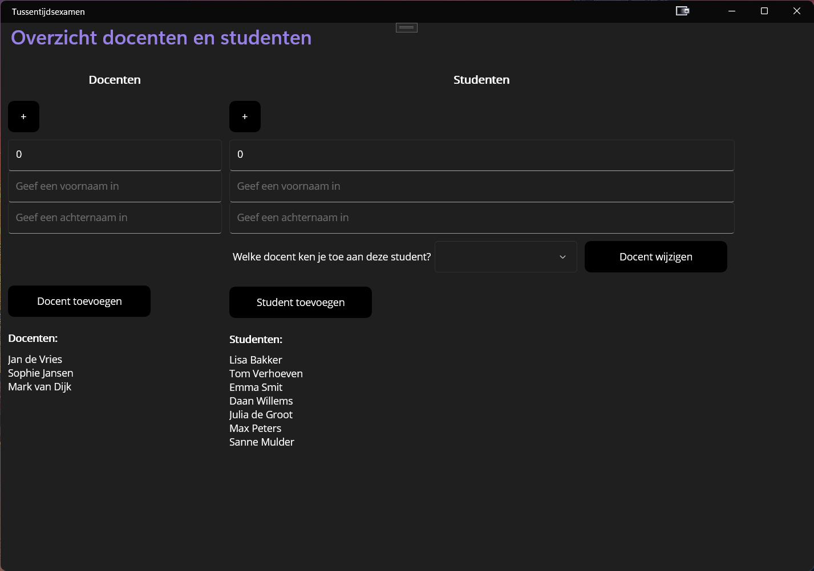
*Figuur 1*

### Docenten

Wanneer we klikken op een docent, worden de gegevens van de docent weergegeven op het hoofdscherm. Zoals te zien is op figuur 2. Wanneer we dubbelklikken op een docent, krijgen we de detailpagina van de docent te zien. We geven enkel de docent-id mee als parameter wanneer we naar de detailpagina navigeren. De detailpagina moet dan de gegevens van de docent ophalen via onze repository. Deze detailpagina toont ook alle studenten die zijn toegewezen aan de docent. We kunnen vervolgens terugnavigeren naar het hoofdscherm via de pijl bovenaan. Zie figuur 3.

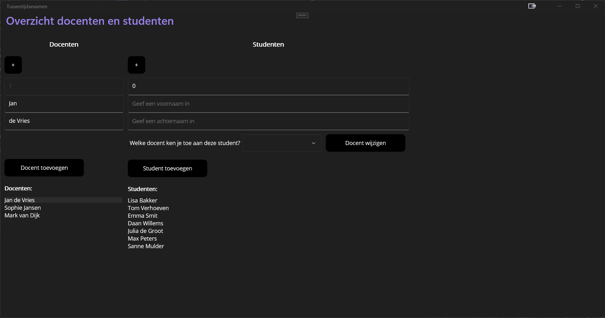
*Figuur 2*

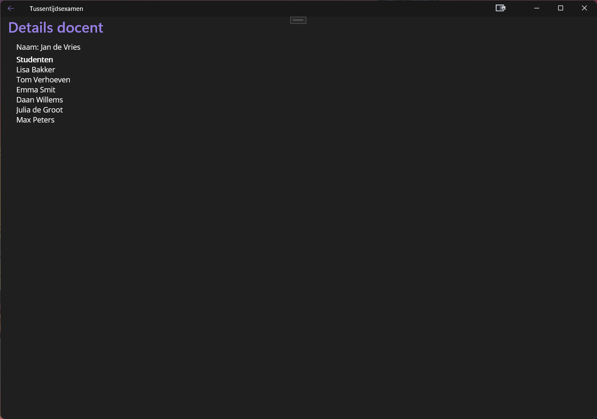
*Figuur 3*

Het is mogelijk om een nieuwe docent aan te maken door op de plusknop te klikken. Het is niet toegelaten om een docent aan de lijst toe te voegen met een id waarde 0. Dit zal een nieuwe lege docent aanmaken. Wanneer we op "Docent toevoegen" klikken, gaan we eerst kijken of er al een docent met die id in de lijst zit. Indien de docent met id zich nog niet in de lijst bevindt, voegen we deze toe. Wanneer er al wel een docent in de lijst zit met deze id, tonen we een foutmelding. Zie figuren 4, 5, 6 en 7.

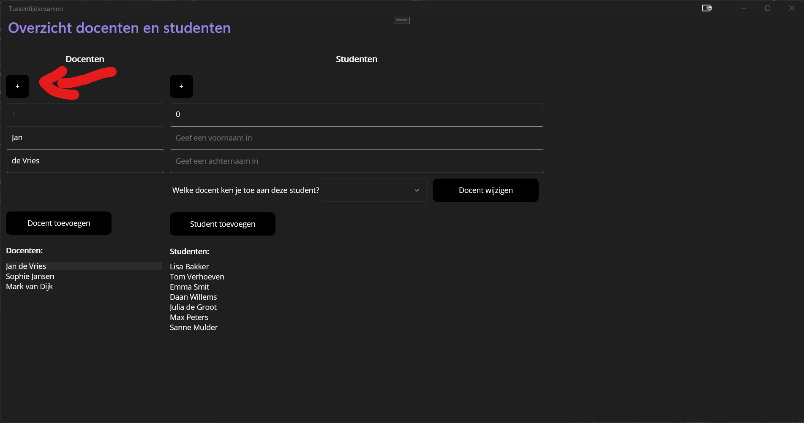
*Figuur 4*

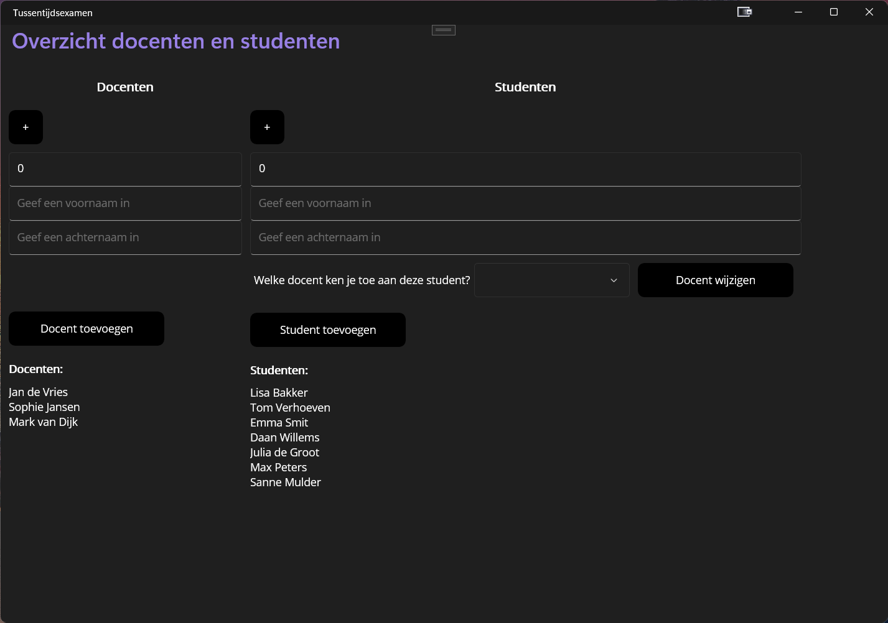
*Figuur 5*

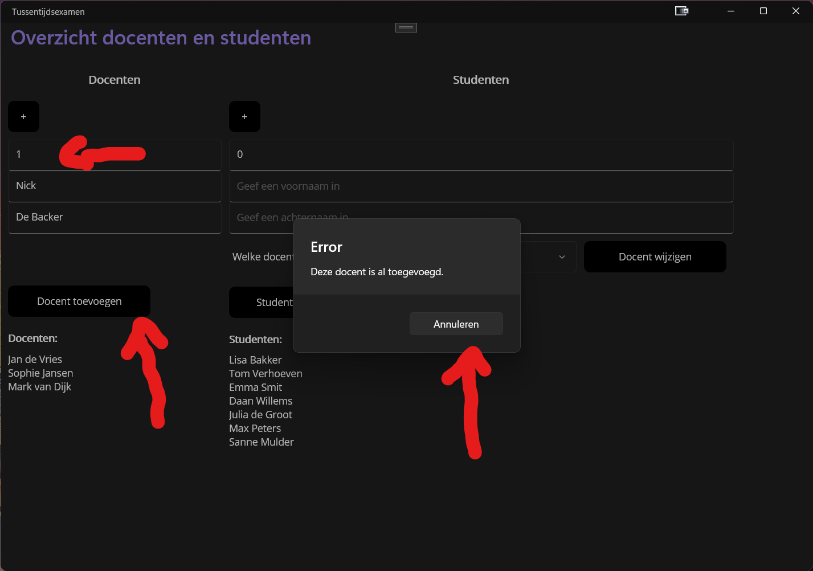
*Figuur 6*

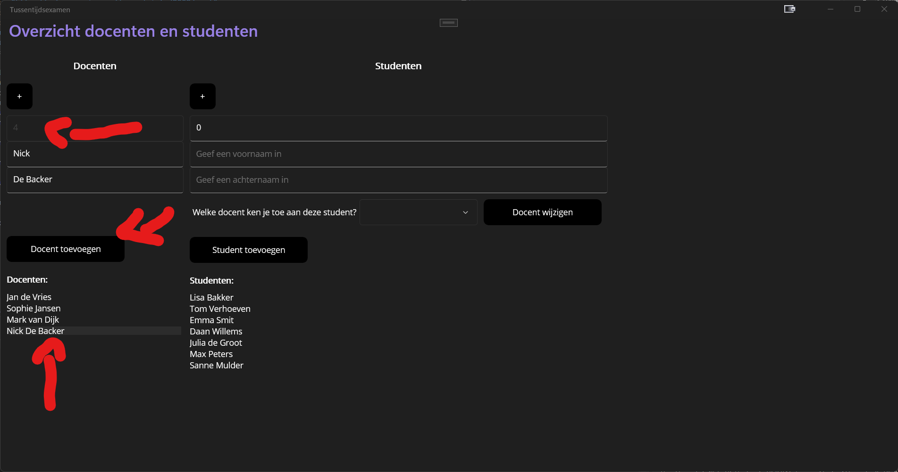
*Figuur 7*

Vanaf het moment dat een docent is toegevoegd aan de lijst, mag het niet toegestaan zijn om de id te wijzigen. Je kan hiervoor gebruikmaken van de IsEnabled-property van het entry-element. Je zal ook een publieke property moeten aanmaken die zal controleren of de id mag worden aangepast. 

1. **Doe dit op het laatste van het examen; dit hebben we niet in de lessen behandeld. == moeilijk**
2. Zie https://learn.microsoft.com/en-us/dotnet/api/communitytoolkit.mvvm.componentmodel.notifypropertychangedforattribute?view=dotnet-comm-toolkit-8.4

### Studenten

Wanneer we klikken op een student, worden de gegevens van de student weergegeven op het hoofdscherm. Zoals te zien op figuur 8. Wanneer we dubbelklikken op een student, krijgen we de detailpagina van de student te zien. We geven enkel de student-id mee als parameter wanneer we naar de detailpagina navigeren. De detailpagina moet dan de gegevens van de student ophalen via onze repository. Deze detailpagina toont ook enkel de volledige naam van de student. We kunnen vervolgens terugnavigeren naar het hoofdscherm via de pijl bovenaan. Zie figuur 9.

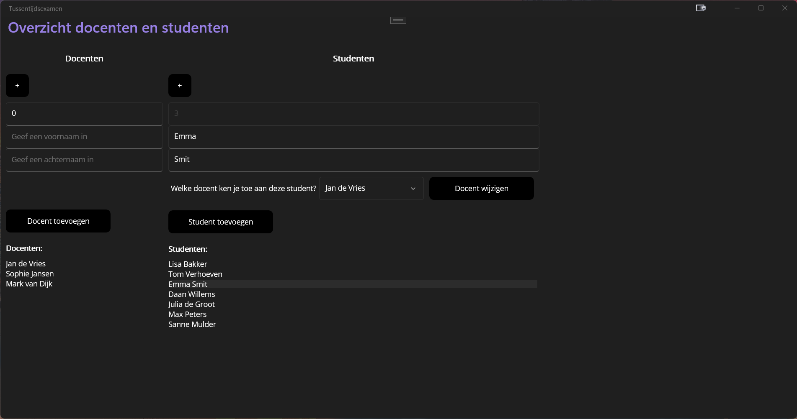
*Figuur 8*

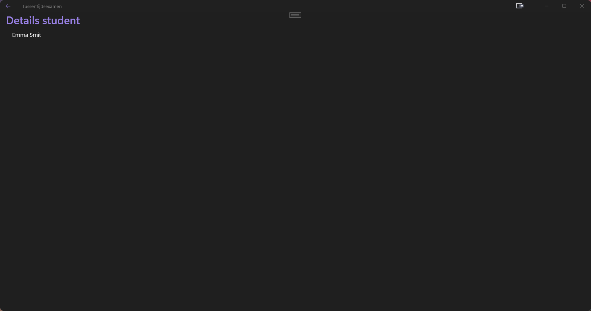
*Figuur 9*

Het is mogelijk om een nieuwe student aan te maken door op de plusknop te klikken. Het is niet toegelaten om een student aan de lijst toe te voegen met een id waarde 0. Dit zal een nieuwe lege student aanmaken. Bij een student krijgen we de optie een docent te selecteren. In tegen stelling tot de voornaam en achternaam, zal de docent enkel te wijzigen zijn door op een knop te klikken. Na het selecteren van een docent EN op de knop "Docent wijzigen" te klikken, zal de docentId worden gezet voor de huidige student. Wanneer we op 'Student toevoegen' klikken, gaan we eerst kijken of er al een student met die id in de lijst zit. Indien de student met id zich nog niet in de lijst bevindt, voegen we deze toe. Wanneer er al wel een student in de lijst zit met deze id, tonen we een foutmelding. Zie figuren 10, 11, 12 en 13.

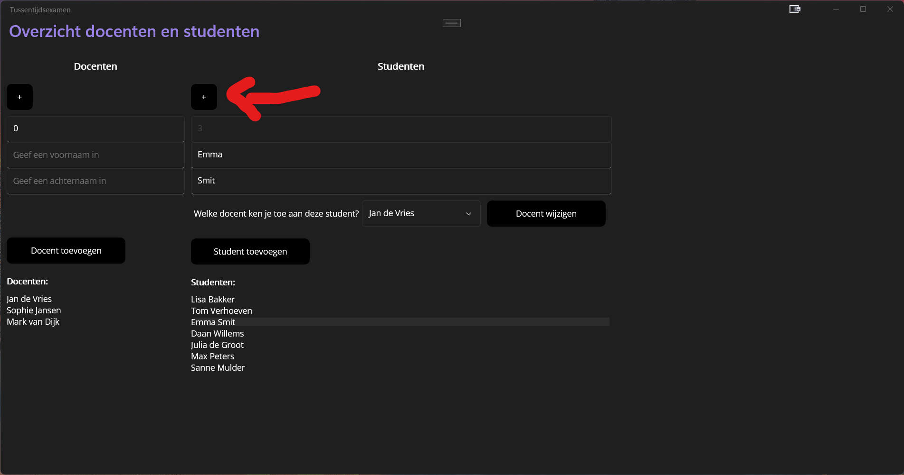
*Figuur 10*

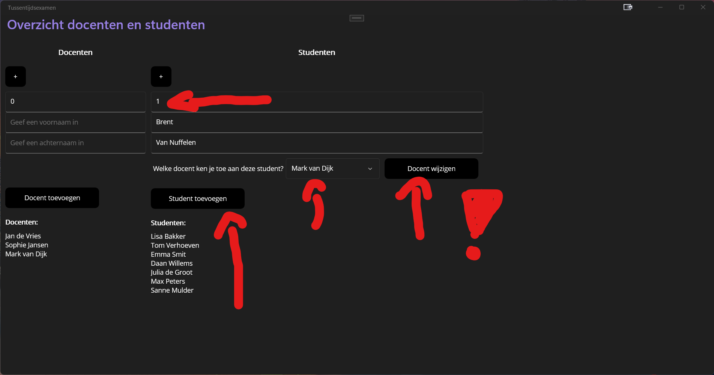
*Figuur 11*

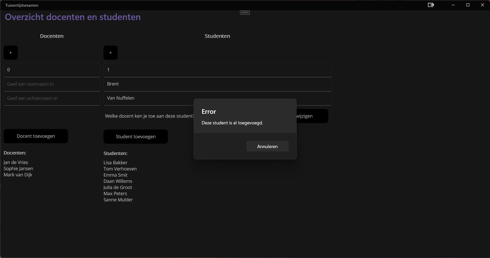
*Figuur 12*

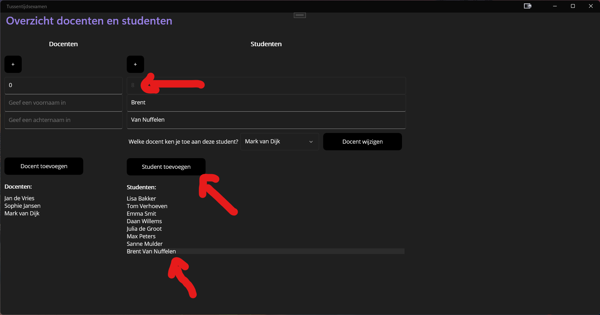
*Figuur 13*

**LET OP. Wanneer je vergeet te klikken op "Docent wijzigen" bij de aanmaakfase van een nieuwe docent, dan zal deze student aan geen enkele docent zijn gekoppeld, ook al heb je wel een docent geselecteerd Dit geldt ook voor het editeren van een student. Zie figuren 14 en 15.**

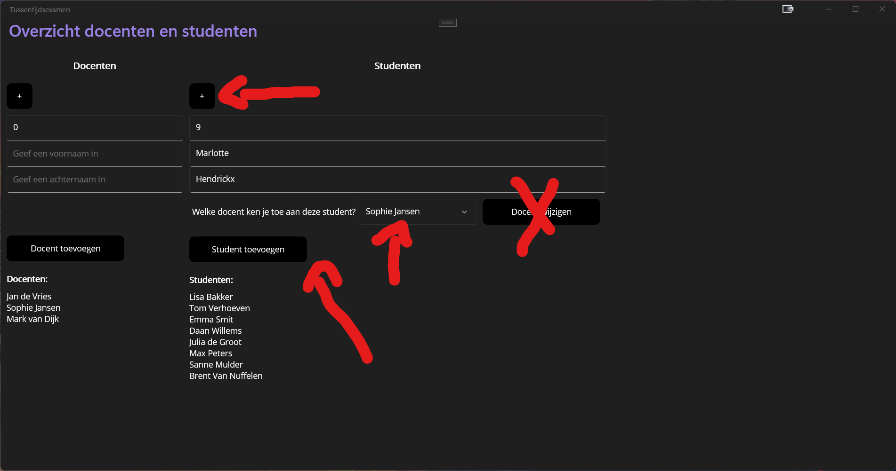
*Figuur 14*

*Figuur 15*

Vanaf het moment dat een student is toegevoegd aan de lijst, mag het niet toegestaan zijn om de id te wijzigen. Je kan hiervoor gebruikmaken van de IsEnabled-property van het entry-element. Je zal ook een publieke property moeten aanmaken die zal controleren of de id mag worden aangepast.

1. **Doe dit op het laatste van het examen; dit hebben we niet in de lessen behandeld. == moeilijk**
2. Zie https://learn.microsoft.com/en-us/dotnet/api/communitytoolkit.mvvm.componentmodel.notifypropertychangedforattribute?view=dotnet-comm-toolkit-8.4

## Bugs? Squash them!

Volgende problemen hoeven niet verholpen te worden tijdens het examen. Hier zal je geen punten mee verliezen. Indien je zelf een oplossing kan bedenken (of vinden) om de volgende problemen op te lossen, mag je deze toevoegen. Er zijn wel geen punten te verdienen door volgende problemen op te lossen.

### Probleem 1: Wanneer ik een docent of student editeer, zie ik deze wijzigingen niet in de lijst

Het is normaal dat wanneer je gegevens zal wijzigen, deze in de lijst niet worden geüpdatet. Wanneer je de persoon selecteert, of naar een detailpagina springt, moet je wel steeds de correcte gegevens te zien krijgen.

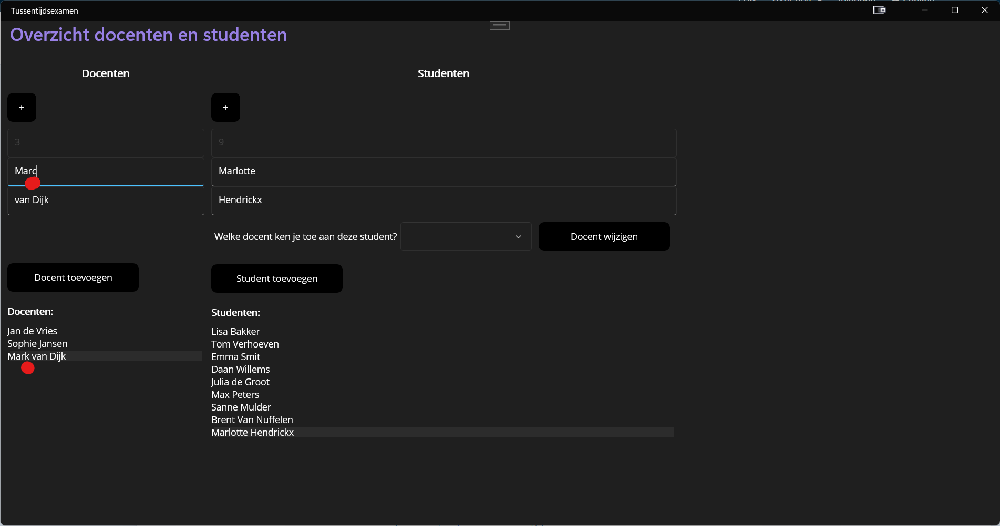
*Probleem 1*

### Probleem 2: Wanneer ik een student toewijs aan een docent, moet ik eerst naar de detailpagina van een andere docent springen

Wanneer je een docent hebt geselecteerd (en daarvoor naar de detailpagina hebt genavigeerd) en vervolgens een student zou toewijzen aan die geselecteerde docent, is het normaal dat je eerst de detailpagina van een andere docent moet raadplegen voordat de studenten zichtbaar veranderen.

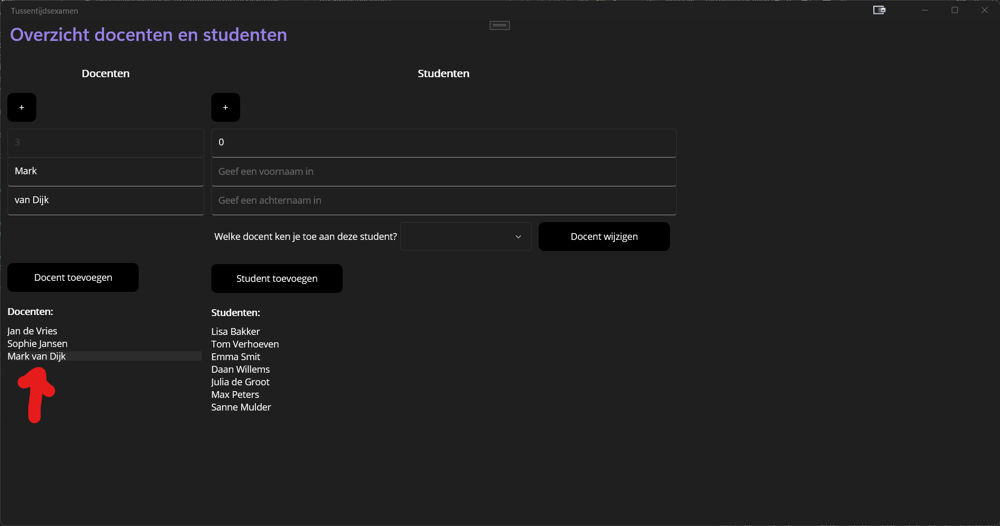
*Probleem 2 - deel 1*

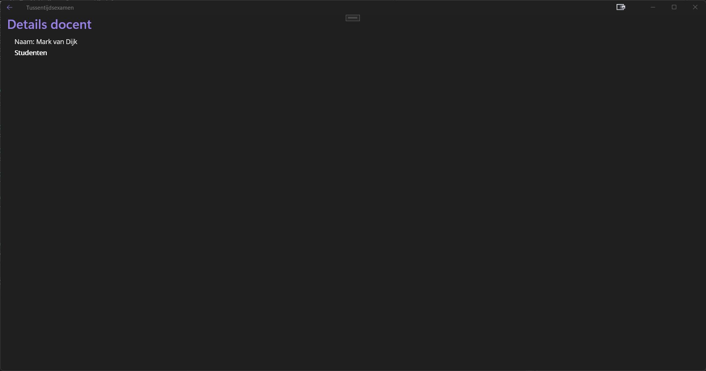
*Probleem 2 - deel 2*

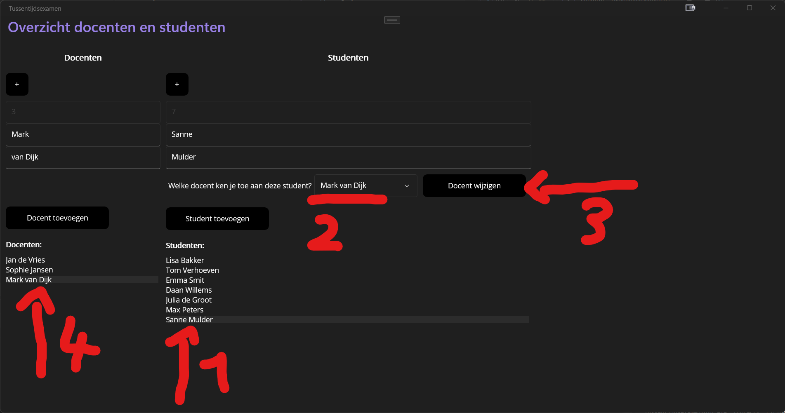
*Probleem 2 - deel 3*

*Probleem 2 - deel 4*

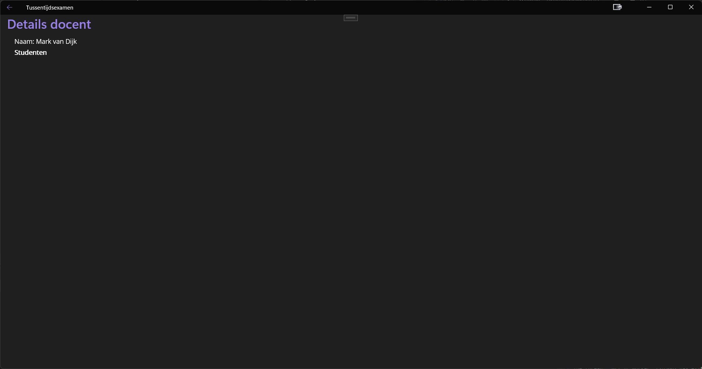
*Probleem 2 - deel 4*

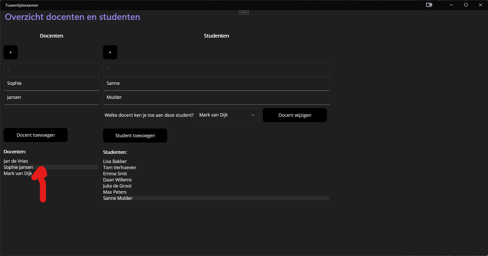
*Probleem 2 - deel 5*

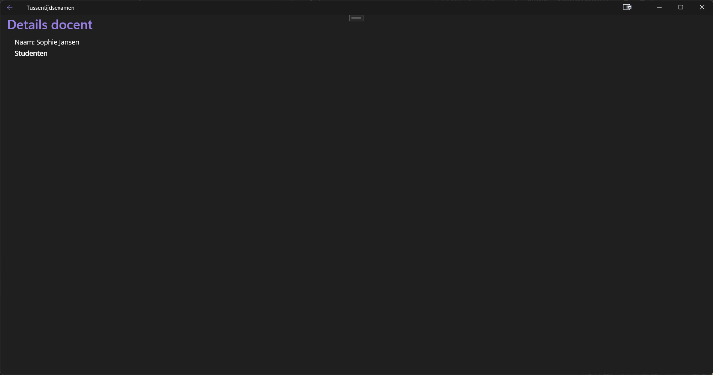
*Probleem 2 - deel 6*

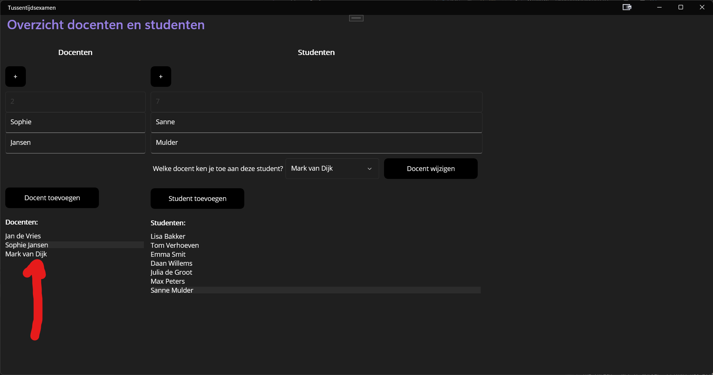
*Probleem 2 - deel 7*

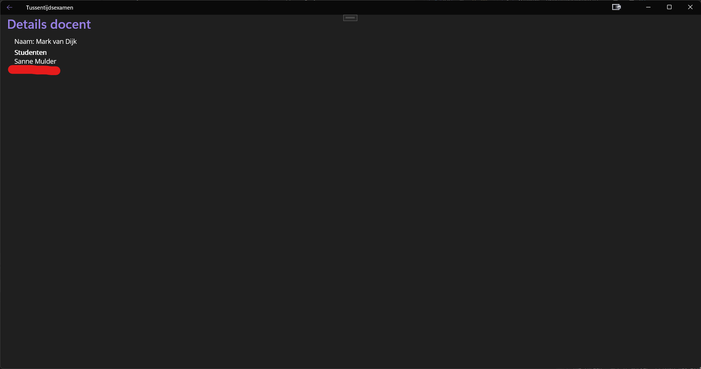
*Probleem 2 - deel 8*

### Probleem 3: Wanneer ik een nieuwe docent of student maak, blijven de gegevens staan wanneer er geen element is geselecteerd in de lijst

Wanneer je een nieuwe docent of student aanmaakt, iets van gegevens invult en vervolgens terug een nieuwe docent of student aanmaakt, blijven de gegevens staan. Wanneer je een docent of student uit de lijst selecteert en daarna een nieuwe docent of student aanmaakt, doet dit probleem zich niet voor.

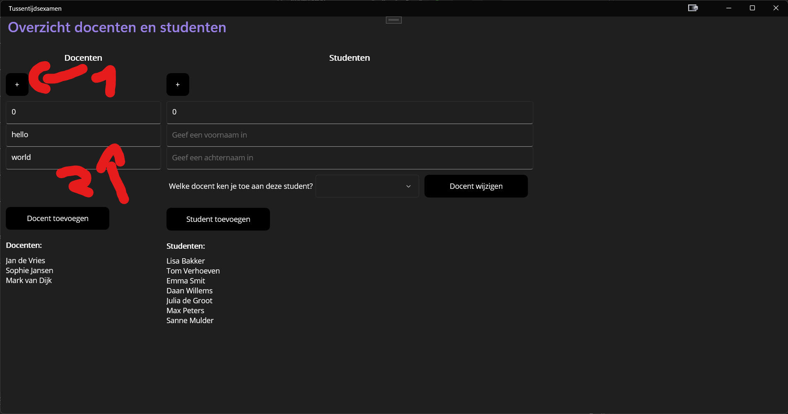
*Probleem 3 - deel 1*

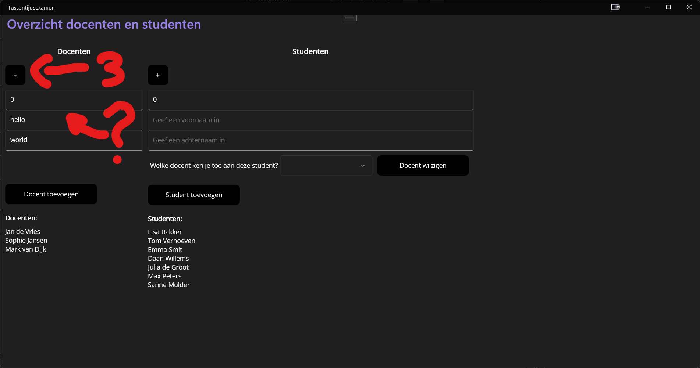
*Probleem 3 - deel 2*

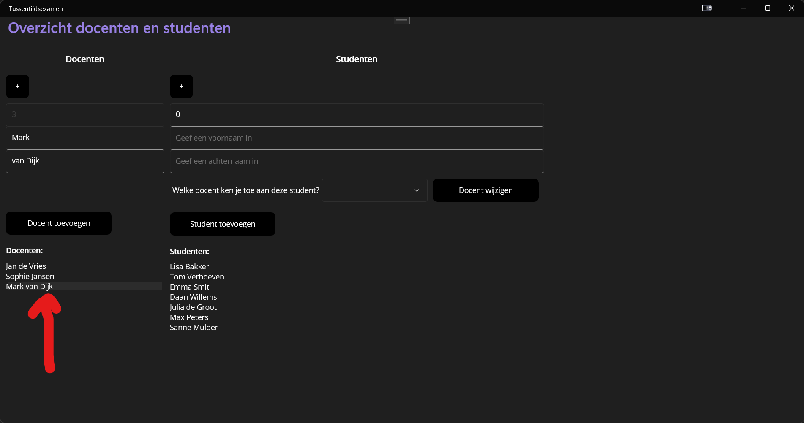
*Probleem 3 - deel 3*

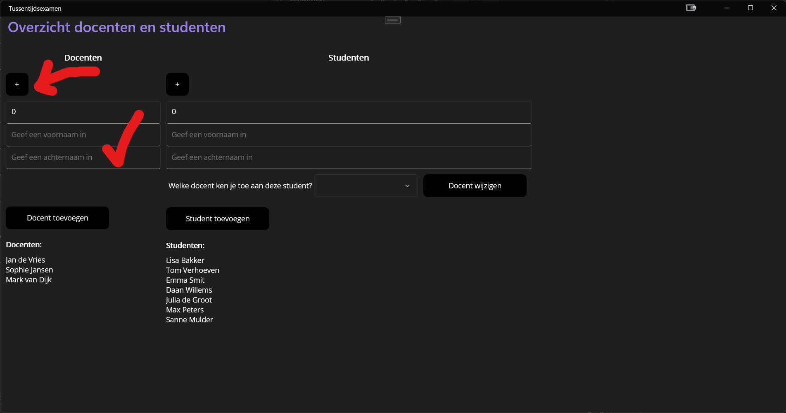
*Probleem 3 - deel 4*